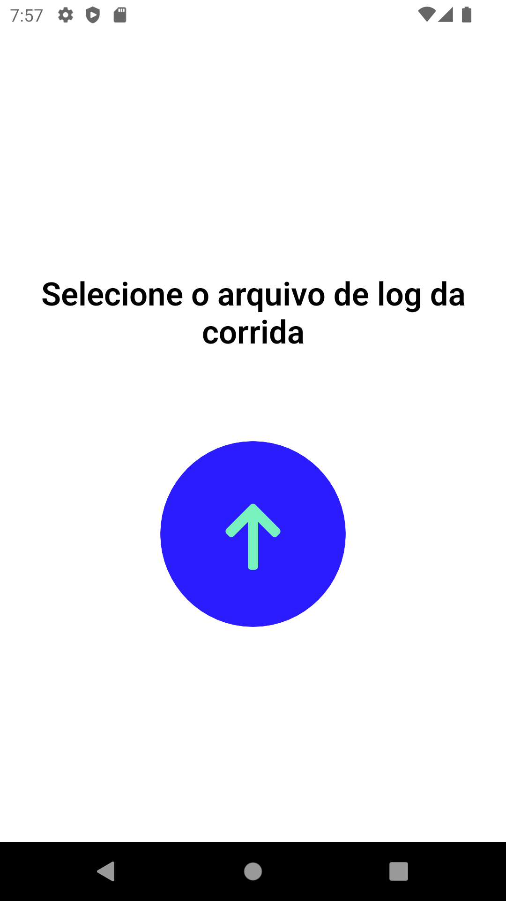
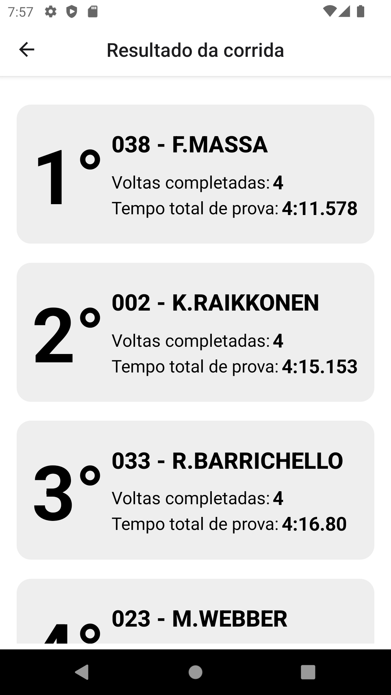
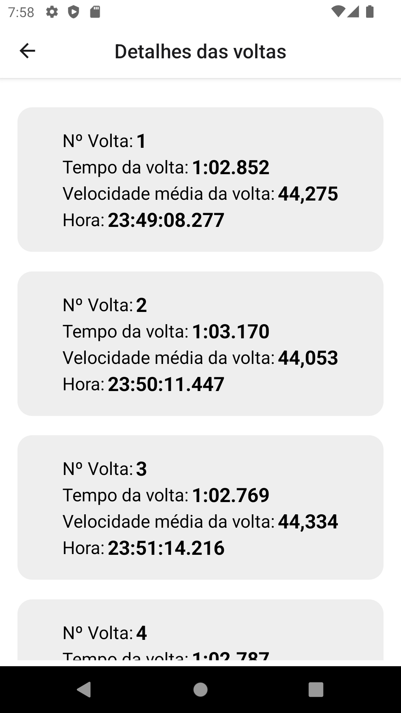
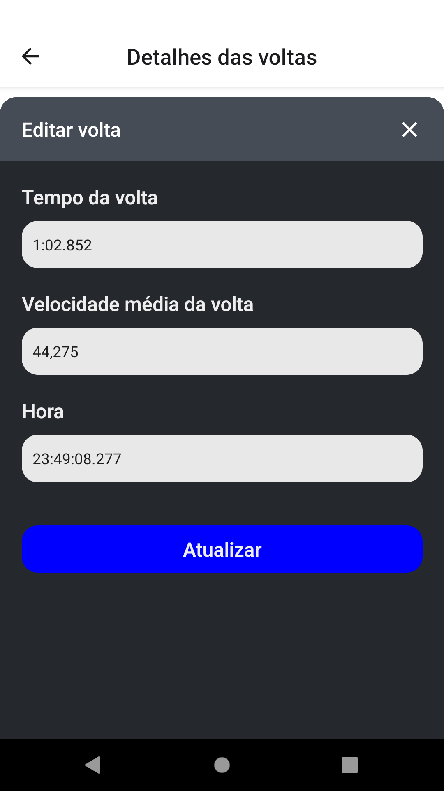

### Download APP APK (<a href="https://drive.google.com/file/d/1G4oNPP-tfrGMnuNuGc5sAFwKR9ptGjuL/view?usp=sharing">Android</a>)

Download the log file with data from a run to test the app:
### <a href="https://drive.google.com/file/d/1mn5mUVJVI8NwY7vW6Qti2yhS8LgMWjf9/view?usp=share_link">DOWNLOAD LOG FILE</a>

# Quick start

Install:

```
git clone git@github.com:gabriel-cardoso-oliveira/ranking-kart.git
```
```
cd ranking-kart/
```
```
npm install
```

Test:

In the project directory, you can run:
```
npx react-native start
```
In another terminal:
```
npx react-native rum-android
```

## Page 1

<p align="center">
  
</p>

## Page 2
<p align="center">
  
</p>

## Page 3
<p align="center">
  
</p>

## Page 4
<p align="center">
  
</p>
